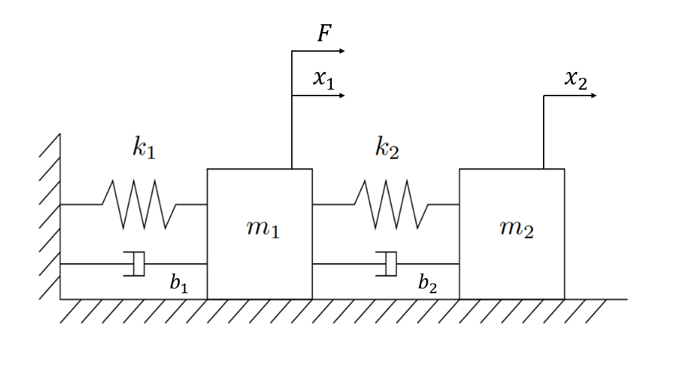
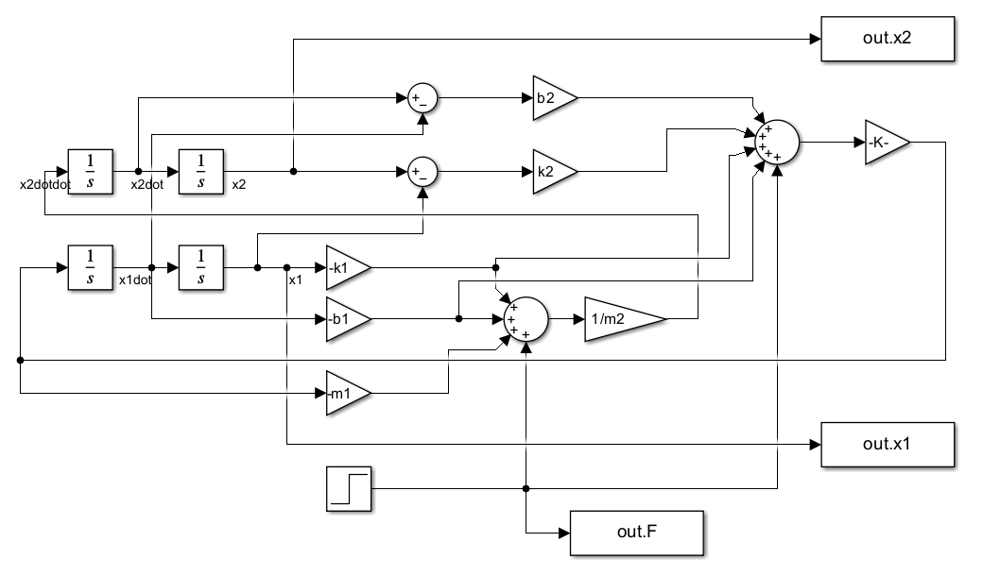
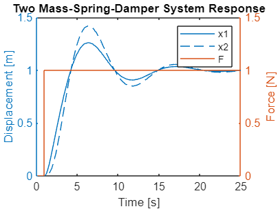

# Two Mass-Spring-Damper System Simulation (ODE)
## System overview



## Simulink schematic



## Code

```matlab:Code
% external force
F = 1;

% spring constants [N/m]
k1 = 1;
k2 = 1;

% damping coefficients [N*s/m]
b1 = 1;
b2 = 1;

% masses [kg]
m1 = 1;
m2 = 1;

% simulation time
sim_time = 25;

sim('./project.slx'); % simulate project

% plot force and displacements
figure
yyaxis left
plot(ans.x1)
hold on 
plot(ans.x2)
ylabel('Displacement [m]')
yyaxis right
plot(ans.F)
ylim([0 1.5])
legend('x1', 'x2', 'F')
ylabel('Force [N]')
xlabel('Time [s]')
title('Two Mass-Spring-Damper System Response')
```


